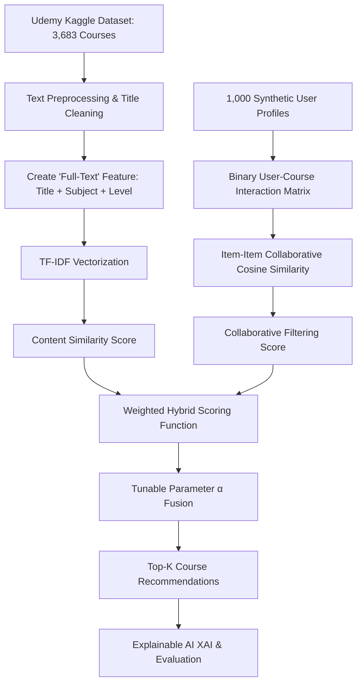

# SmartRecSys: An Intelligent Hybrid Recommender System for Personalized E-Learning in Smart Campus Environments Addressing the Cold-Start Problem

Welcome to the **SmartRecSys** repository, a foundational workspace for our major engineering project. This repository aggregates key international literature from **IEEE** and **Elsevier** to guide the architectural design, algorithmic choices, and evaluation methodologies of our smart campus recommendation platform.

---

## 📖 Executive Summary & Context

Personalized e-learning is a core pillar of modern digital transformation in higher education. With the development of smart campuses, educational institutions collect massive amounts of user behavior and educational content data. Traditional recommender systems fail to address the specific pedagogical and technical constraints of this environment. 

**SmartRecSys** aims to extend our previous research (*EduRecSys*) by integrating multi-modal contextual parameters, student cognitive profiles, and semantic course metadata. The objective is to build an adaptive recommendation engine that solves the cold-start problem, resolves data sparsity, and operates at scale in a smart campus ecosystem.

---

## 🔍 Reference Paper Analysis

This project directly leverages the methodology, findings, and dataset modeling presented in the reference paper:
> **Paper Title:** *An Intelligent Hybrid Recommendation System for E-Learning Personalization in Smart Campus*  
> **Author:** Manar Joundy Hazar (2025)  
> **Journal:** International Journal of Scientific Research in Science and Technology (Volume 12, Issue 5)

The reference paper outlines three core challenges in contemporary academic recommendation systems and implements a hybrid content-collaborative model designed for smart educational environments.

### 1. The Three Core Problems of Educational Recommenders

*   **Cold-Start Problem:** Recommender systems struggle when a new user joins the platform (user cold-start) or when a new course is added (item cold-start) due to the complete lack of interaction records. The reference paper addresses this by utilizing content-based text representations (TF-IDF vectors of course titles, levels, and subjects) to compute semantic similarities, allowing course recommendations even when zero behavioral data is available.
*   **Data Sparsity:** In a smart campus with thousands of courses and diverse learners, the user-item interaction matrix is extremely sparse (most cells are zero). Collaborative filtering algorithms fail to find meaningful user or item neighbors when overlap is minimal. Combining behavioral similarity with content similarity mitigates the impact of matrix sparsity.
*   **Lack of Contextual Adaptability:** Standard filtering approaches treat learner preferences statically. They fail to adapt to dynamic, real-time campus variables (e.g., student cognitive progression, current semester workload, learning path constraints, and device utilization). The reference paper advocates for context-sensitive hybrid filtering that evolves with the learner's feedback loop.

### 2. Smart Campus Implementation Methodology

The reference paper proposes a hybrid course recommendation pipeline validated through a simulated smart campus environment:



*   **Dataset Modeling:** Utilizes a dataset of 3,683 Udemy courses from Kaggle, containing attributes such as difficulty levels (*Beginner*, *Intermediate*, *Expert*, *All Levels*) and subjects (*Business Finance*, *Web Development*, *Graphic Design*, *Musical Instruments*).
*   **Simulation of Campus Learners:** Emulates real-world campus interactions by generating 1,000 synthetic student profiles. Each profile is assigned a preferred subject and a history of 3 to 10 course enrollments, building a binary user-course interaction matrix.
*   **Algorithmic Fusion:** 
    *   **Content Score:** Text preprocessing (lowercasing, punctuation/stopword removal) on course titles, subjects, and levels is converted to a vector space via TF-IDF vectorization. Cosine similarity is computed between courses.
    *   **Collaborative Score:** Computes item-item similarity based on co-enrollment patterns across the simulated user base using Cosine Similarity on the transposed user-course matrix.
    *   **Hybrid Integration:** Fuses content-based ($Score_{\text{content}}$) and collaborative ($Score_{\text{collaborative}}$) scores through a weighted normalization scheme:
        $$\text{Score}_{\text{hybrid}} = \alpha \cdot \text{Score}_{\text{content}} + (1 - \alpha) \cdot \text{Score}_{\text{collaborative}}$$
        where $\alpha \in [0, 1]$ is a tunable parameter.
*   **Evaluation Results:** Conducted using 6-fold cross-validation at thresholds $K=3$ and $K=5$. Fusing semantic and behavioral signals resulted in:
    *   **Precision@3:** $0.3333$ (highest)
    *   **Recall@3 / Recall@5:** $1.0000$ (perfect recall)
    *   Outperformed standalone content-based (Recall@3: $0.9861$, Precision@3: $0.3287$) and collaborative (Recall@3: $0.9748$, Precision@3: $0.3249$) baselines.

---

## 📚 Bibliography of Downloaded Research Papers

We have downloaded **20 high-quality, peer-reviewed international research papers** (10 from **IEEE** and 10 from **ELSEVIER**) to support our literature review.

### 📂 IEEE Folder (10 Papers)
1.  **[A Recommender System For Open Educational Videos Based On Skill Requirements](file:///Users/jayantshoundik/Desktop/Major%20Project/IEEE/A_Recommender_System_For_Open_Educational_Videos_Based_On_Skill_Requirements.pdf)**
    *   *Abstract:* Connects open educational video suggestions directly to real-world job market skill requirements using job posting analysis.
2.  **[A Survey on Federated Recommendation Systems](file:///Users/jayantshoundik/Desktop/Major%20Project/IEEE/A_Survey_on_Federated_Recommendation_Systems.pdf)**
    *   *Abstract:* Reviews decentralized collaborative filtering methodologies that preserve learner privacy under smart campus structures.
3.  **[BPL: Bias-adaptive Preference Distillation Learning for Recommender System](file:///Users/jayantshoundik/Desktop/Major%20Project/IEEE/BPL_Bias-adaptive_Preference_Distillation_Learning_for_Recommender_System.pdf)**
    *   *Abstract:* Addresses feedback bias in user matrices to distill clean user preferences, enhancing prediction accuracy.
4.  **[Causal Incremental Graph Convolution for Recommender System Retraining](file:///Users/jayantshoundik/Desktop/Major%20Project/IEEE/Causal_Incremental_Graph_Convolution_for_Recommender_System_Retraining.pdf)**
    *   *Abstract:* Introduces dynamic graph updating to incorporate new user interactions without retraining the model from scratch.
5.  **[Exploring Customer Price Preference and Product Profit Role in Recommender Systems](file:///Users/jayantshoundik/Desktop/Major%20Project/IEEE/Exploring_Customer_Price_Preference_and_Product_Profit_Role_in_Recommender_Syste.pdf)**
    *   *Abstract:* Analyzes the balance between user preference constraints and platform/provider objectives in recommendation engines.
6.  **[Influential Recommender System](file:///Users/jayantshoundik/Desktop/Major%20Project/IEEE/Influential_Recommender_System.pdf)**
    *   *Abstract:* Explores peer-influence networks to simulate social interactions and information diffusion in recommender systems.
7.  **[Intent-Aware Contextual Recommendation System](file:///Users/jayantshoundik/Desktop/Major%20Project/IEEE/Intent-Aware_Contextual_Recommendation_System.pdf)**
    *   *Abstract:* Models changing user intent and context dynamically, helping recommenders adapt to real-time session inputs.
8.  **[Movie Recommender System using critic consensus](file:///Users/jayantshoundik/Desktop/Major%20Project/IEEE/Movie_Recommender_System_using_critic_consensus.pdf)**
    *   *Abstract:* Explores consensus-driven aggregation techniques to address high sparsity and cold-start scenarios.
9.  **[Quantitative analysis of Matthew effect and sparsity problem of recommender systems](file:///Users/jayantshoundik/Desktop/Major%20Project/IEEE/Quantitative_analysis_of_Matthew_effect_and_sparsity_problem_of_recommender_syst.pdf)**
    *   *Abstract:* Examines the "rich get richer" popularity bias (Matthew effect) in recommender platforms and models methods to combat sparsity.
10. **[Real-Time Learning from An Expert in Deep Recommendation Systems with Marginal Data](file:///Users/jayantshoundik/Desktop/Major%20Project/IEEE/Real-Time_Learning_from_An_Expert_in_Deep_Recommendation_Systems_with_Marginal_D.pdf)**
    *   *Abstract:* Integrates reinforcement learning and expert guidance (teacher-student models) to accelerate system convergence when interaction data is sparse.

---

### 📂 ELSEVIER Folder (10 Papers)
1.  **[De-centering the Traditional User: Multistakeholder Evaluation of Recommender Systems](file:///Users/jayantshoundik/Desktop/Major%20Project/ELSEVIER/De-centering_the_Traditional_User_Multistakeholder_Evaluation_of_Recommender_Sys.pdf)**
    *   *Abstract:* Proposes a multi-stakeholder assessment framework that evaluates recommendations from the perspective of students, professors, and administrative planners.
2.  **[Federated Recommender System with Data Valuation for E-commerce Platform](file:///Users/jayantshoundik/Desktop/Major%20Project/ELSEVIER/Federated_Recommender_System_with_Data_Valuation_for_E-commerce_Platform.pdf)**
    *   *Abstract:* Formulates data valuation metrics for secure, distributed recommender networks.
3.  **[GHRS: Graph-based Hybrid Recommendation System with Application to Movie Recommendations](file:///Users/jayantshoundik/Desktop/Major%20Project/ELSEVIER/GHRS_Graph-based_Hybrid_Recommendation_System_with_Application_to_Movie_Recommen.pdf)**
    *   *Abstract:* Details graph-based representations of hybrid systems, showcasing how content nodes and user nodes link in a graph neural network.
4.  **[Ready for Emerging Threats to Recommender Systems: A Graph Convolution-based Generator](file:///Users/jayantshoundik/Desktop/Major%20Project/ELSEVIER/Ready_for_Emerging_Threats_to_Recommender_Systems_A_Graph_Convolution-based_Gene.pdf)**
    *   *Abstract:* Explores adversarial resilience in graph recommender systems, protecting course databases from recommendation poisoning attacks.
5.  **[Deep Latent Factor Model for Collaborative Filtering](file:///Users/jayantshoundik/Desktop/Major%20Project/ELSEVIER/Deep_Latent_Factor_Model_for_Collaborative_Filtering.pdf)**
    *   *Abstract:* Implements neural network architectures to project sparse user-item interaction histories into deep latent factor representations.
6.  **[A Hybrid Recommender System for Recommending Smartphones to Prospective Customers](file:///Users/jayantshoundik/Desktop/Major%20Project/ELSEVIER/A_Hybrid_Recommender_System_for_Recommending_Smartphones_to_Prospective_Customer.pdf)**
    *   *Abstract:* Demonstrates practical hybrid recommendation utilizing feature matching and user demographics.
7.  **[A blockchain-based intelligent recommender system framework for enhancing supply chain](file:///Users/jayantshoundik/Desktop/Major%20Project/ELSEVIER/A_blockchain-based_intelligent_recommender_system_framework_for_enhancing_supply.pdf)**
    *   *Abstract:* Evaluates decentralized data sharing trust frameworks, applicable to verified skill credentialing in campus education.
8.  **[Use of recommendation models to provide support to dyslexic students](file:///Users/jayantshoundik/Desktop/Major%20Project/ELSEVIER/Use_of_recommendation_models_to_provide_support_to_dyslexic_students.pdf)**
    *   *Abstract:* Outlines adaptive content selection for learners with special educational needs (dyslexia), highlighting accessibility modeling.
9.  **[Model-agnostic post-hoc explainability for recommender systems](file:///Users/jayantshoundik/Desktop/Major%20Project/ELSEVIER/Model-agnostic_post-hoc_explainability_for_recommender_systems.pdf)**
    *   *Abstract:* Proposes architectures to generate post-hoc explanations for recommendations, critical for transparent, pedagogical e-learning guidance.
10. **[Using consumer feedback from location-based services in PoI recommender systems](file:///Users/jayantshoundik/Desktop/Major%20Project/ELSEVIER/Using_consumer_feedback_from_location-based_services_in_PoI_recommender_systems_.pdf)**
    *   *Abstract:* Utilizes spatial-temporal feedback, providing design cues for location-aware recommendation in physical smart campuses.

---

## 🛠️ Setup & Git Usage

This repository is initialized with local tracking. To link it to your GitHub account and push the current set of papers and documentation:

1.  **Initialize Git (Done locally):**
    ```bash
    git init
    git add .
    git commit -m "feat: initial commit with IEEE and Elsevier research directories and project README"
    ```
2.  **Link to GitHub:**
    Create a new repository on your GitHub account, then execute:
    ```bash
    git remote add origin <your-github-repo-url>
    git branch -M main
    git push -u origin main
    ```
