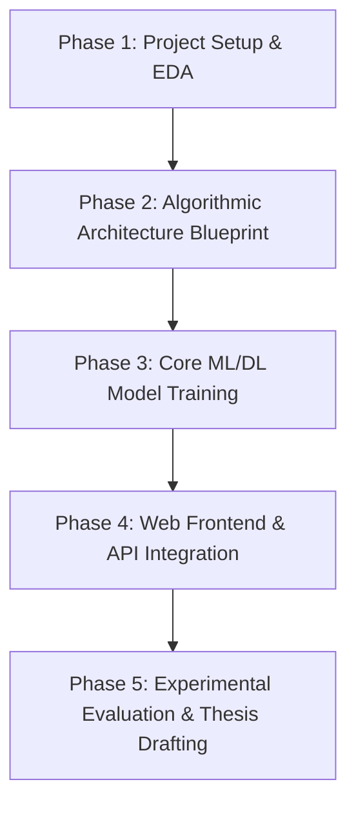

# SmartRecSys: 4th-Year Engineering Major Project Task Board

This document defines the roles, workflows, and responsibilities for our final-year (4th-year) Engineering Major Project. 

In this project, research is centralized: **Member 3 (System Architect & Literature Lead) reads all IEEE and Elsevier research papers** and compiles an **Algorithmic Blueprint** to guide the implementation of Member 4 (ML/DL Engineer) and the interface of Member 2 (Frontend Engineer).

---

## 📋 4th-Year Major Project Roadmap

---

## 👤 Member 1: Jayant (Project Lead & Core Backend)
*   **Role**: Project Management, Repository Setup, initial code architecture, and Exploratory Data Analysis.
*   **Status**: Completed ✅
*   **Tasks Assigned**:
    *   Initialize the repository, setup directory structure, and download initial 20 peer-reviewed papers.
    *   Download the Udemy course database (`udemy_courses.csv`).
    *   Write the EDA script (`eda.py`) to generate visualization plots of course distributions, levels, and user attributes.
*   **Key Files**:
    *   `download_dataset.py`, `eda.py`, `plots/`
    *   `README.md` (Project abstract and reference paper overview).

---

## 👤 Member 2: Frontend UI/UX Engineer
*   **Role**: Dashboard and user interface design for the Smart Campus personalized learning system.
*   **Status**: Pending Setup ⏳
*   **Setup Guide**: Refer to **[docs/frontend_guide.md](file:///Users/jayantshoundik/Desktop/Major%20Project/docs/frontend_guide.md)**.
*   **Tasks Assigned**:
    *   Develop a responsive web dashboard for students to log in, specify cognitive/skill preferences, and view recommendations.
    *   Design interactive components that categorize recommended courses by domain (e.g. Web Development) and difficulty level.
    *   Connect user query inputs (selected courses) to the backend recommender engine using API calls (e.g. via Flask or FastAPI).
*   **Key Files**:
    *   `frontend/index.html`, `frontend/dashboard.html`, `frontend/style.css`, `frontend/app.js`
    *   `docs/frontend_guide.md` (API payload contracts and mock integration scripts).
*   **Algorithmic Integration**:
    *   Render the recommendation scores and list returned by the hybrid model (`recommender.py`) and deep learning model (`dl_recommender_gpu.py`).

---

## 👤 Member 3: System Architect & Literature Lead (Centralized Research)
*   **Role**: Primary reader of all research papers; responsible for literature synthesis, algorithmic modeling, and technical thesis drafting.
*   **Status**: In Progress ✍️
*   **Tasks Assigned**:
    *   **Literature Synthesis**: Read the 10 IEEE and 10 Elsevier papers to extract state-of-the-art recommendation strategies.
    *   **Algorithmic Blueprint**: Write a design document (`docs/algorithmic_blueprint.md`) explaining the math behind TF-IDF, Cosine Similarity, Singular Value Decomposition (SVD), and Neural Collaborative Filtering (NCF).
    *   **Guidance**: Advise Member 4 on how to tune hyperparameters (such as user-item embedding dimensions, dropout rates, and hybrid weights) based on findings in the literature.
    *   **Thesis Writing**: Draft the final 4th-year engineering project report/thesis.
*   **Key Files**:
    *   `docs/literature_review.md` (Analysis of the 20 papers).
    *   `docs/algorithmic_blueprint.md` (Mathematical guidelines for the team).
    *   `docs/implementation_summary.md` (Current parameters and codebase summary).
*   **Papers to Analyze**:
    *   All 10 papers in the `IEEE/` folder and 10 papers in the `ELSEVIER/` folder.

---

## 👤 Member 4: ML/DL Model Engineer
*   **Role**: Model implementation, PyTorch training, cross-validation, and performance optimization.
*   **Status**: Backend Models Written 💻 (Awaiting tuning from Member 3)
*   **Setup & Training Guide**: Refer to **[docs/ml_training_guide.md](file:///Users/jayantshoundik/Desktop/Major%20Project/docs/ml_training_guide.md)**.
*   **Tasks Assigned**:
    *   Implement the content-collaborative similarity scores (`recommender.py`).
    *   Implement and train the Singular Value Decomposition (SVD) matrix factorization model (`evaluate_ml.py`).
    *   Train the PyTorch Neural Collaborative Filtering (NCF) deep learning network, utilizing GPU/MPS acceleration (`dl_recommender_gpu.py`).
    *   Implement 6-fold cross-validation and generate precision-recall performance comparisons under `plots/evaluation_comparison.png`.
*   **Key Files**:
    *   `recommender.py`, `evaluate_ml.py`, `dl_recommender_gpu.py`, `models/ncf_recommender.pth`
    *   `docs/ml_training_guide.md` (Tuning guidelines and hardware instructions).
*   **Core Algorithms**:
    *   Matrix Factorization (Truncated SVD), Neural Collaborative Filtering (MLP embeddings).
